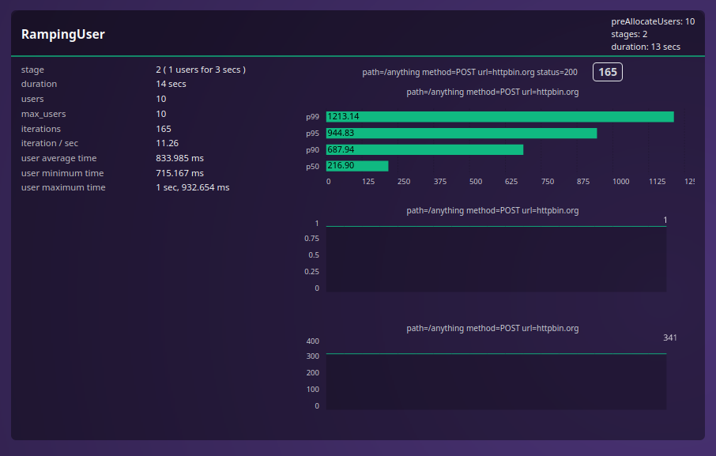

# Loates

Loates is a blazingly fast 🚀 load testing library for Rust, with focus on ease of use and flexiblity.
Loates is inspired by tools like grafana k6, you can easily simulate a high number of users to test the performance and reliability of your web applications and APIs.

Instead of being a tool like k6 which runs javascript for you, loates is a simple rust library that any user can use to define their testcases. Loates is not desgined with any paticular usecase in mind. It's upto the user to decide what they wanna loadtest and how.



## Features

- **High Performance**: Leveraging Rust's performance and safety, Loates can handle a high number of virtual users and concurrent requests with minimal overhead.
- **Extensible**: Customizable test scenarios with a simple to use api.
- **Real-time Metrics**: Get real-time feedback and detailed metrics on your application's performance.

## Roadmap

- CLI/TUI components
- Inbuilt webserver to show results on a browser realtime
- Making it easier to run in a distributed setup
- covering more usecases.
- Simulating more complex patterns

## Getting Started

### Prerequisites

- Rust (latest stable version)
- Cargo (Rust package manager)

### Example

```rust
use std::time::Duration;

use loates::client::reqwest::Client;
use loates::error::Error;
use loates::prelude::*;

struct MyUser<Iter> {
    client: Client,
    post_content: Iter,
}

impl<'a, Iter> User for MyUser<Iter>
where
    Iter: Iterator<Item = &'a String> + Send,
{
    async fn call(&mut self) -> Result<(), Error> {
        // In each iteration get the next string
        let body = self.post_content.next().unwrap().to_string();
        let res = self
            .client
            .post("https://httpbin.org/anything")
            .body(body)
            .send()
            .await?;

        if !res.status().is_success() {
            let body = res
                .bytes()
                .await
                .map_err(|err| Error::TerminationError(err.into()))?;

            let err = String::from_utf8_lossy(&body).to_string();
            return Err(Error::termination(err));
        }

        tokio::time::sleep(Duration::from_millis(500)).await;

        Ok(())
    }
}

async fn datastore(store: &mut RuntimeDataStore) {
    let data = vec!["a".to_string(), "b".to_string(), "c".to_string()];
    store.insert(data);
    store.insert(Client::new());
}

async fn user_builder(runtime: &RuntimeDataStore) -> impl User + '_ {
    let client: &Client = runtime.get().unwrap();
    let content: &Vec<String> = runtime.get().unwrap();

    MyUser {
        client: client.clone(),
        post_content: content.iter().cycle(),
    }
}

#[tokio::main]
async fn main() {
    let execution_once = Execution::builder()
        .with_user_builder(user_builder)
        .with_data(datastore)
        .with_executor(Executor::Once);

    let execution_shared = Execution::builder()
        .with_user_builder(user_builder)
        .with_data(datastore)
        .with_executor(Executor::Shared {
            users: 2,
            iterations: 1000,
            duration: Duration::from_secs(100),
        });

    let scenario =
        Scenario::new("scene1".to_string(), execution_shared).with_executor(execution_once);
    let scenarios = vec![scenario];

    Runner::new(scenarios).enable_tui(true).run().await.unwrap();
}
```

Just build your test and deploy anywhere.

```shell
cargo run --release
```

## Contributing

We welcome contributions from the community! If you'd like to contribute, please fork the repository and submit a pull request. For major changes, please open an issue first to discuss what you would like to change.

1.  Fork the repository
2.  Create a new branch (git checkout -b feature-branch)
3.  Make your changes
4.  Commit your changes (git commit -m 'Add some feature')
5.  Push to the branch (git push origin feature-branch)
6.  Open a pull request

### Happy Load Testing! 🚀
